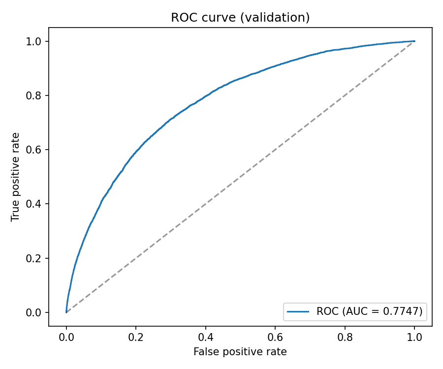
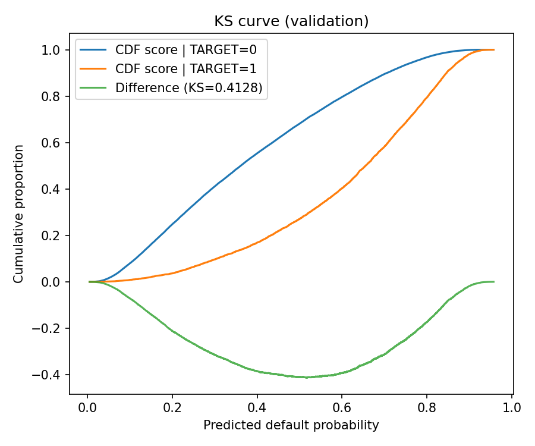
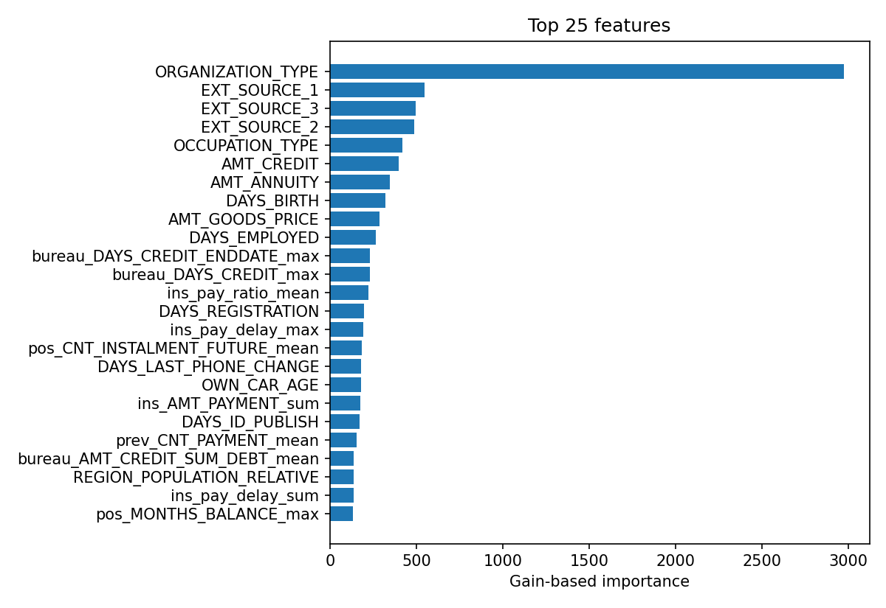

# Credit Risk Modeling for Loan Underwriting

**This project builds an end to end underwriting risk scoring pipeline that predicts loan default risk from multi table applicant and credit history data and supports approval thresholding and portfolio impact analysis**

**This is a solid underwriting score because it reaches ROC AUC 0.7747 and KS 0.4128 on a strict pre application feature set and the cutoff simulation shows a clear risk return tradeoff where a 0.10 score cutoff yields expected loss proxy mean 47241 among approved versus 164364 at 0.50 with much lower default rate at the stricter cutoff which means the score supports real approval policy tuning with measurable portfolio impact**

Dataset source: [Kaggle Home Credit Default Risk](https://www.kaggle.com/c/home-credit-default-risk/data)

| File | Rows | Columns | Column examples |
|---|---:|---:|---|
| `application_train.csv` | 307511 | 122 | `SK_ID_CURR`, `TARGET`, `AMT_INCOME_TOTAL`, `AMT_CREDIT`, `AMT_ANNUITY`, `EXT_SOURCE_1` |
| `application_test.csv` | 48744 | 121 | `SK_ID_CURR`, `AMT_INCOME_TOTAL`, `AMT_CREDIT`, `AMT_ANNUITY`, `EXT_SOURCE_1` |
| `bureau.csv` | 1716428 | 17 | `SK_ID_CURR`, `SK_ID_BUREAU`, `CREDIT_ACTIVE`, `DAYS_CREDIT`, `AMT_CREDIT_SUM` |
| `bureau_balance.csv` | 27299925 | 3 | `SK_ID_BUREAU`, `MONTHS_BALANCE`, `STATUS` |
| `previous_application.csv` | 1670214 | 37 | `SK_ID_PREV`, `SK_ID_CURR`, `AMT_APPLICATION`, `AMT_CREDIT`, `DAYS_DECISION` |
| `POS_CASH_balance.csv` | 10001358 | 8 | `SK_ID_PREV`, `SK_ID_CURR`, `MONTHS_BALANCE`, `SK_DPD`, `SK_DPD_DEF` |
| `credit_card_balance.csv` | 3840312 | 23 | `SK_ID_PREV`, `SK_ID_CURR`, `MONTHS_BALANCE`, `AMT_BALANCE`, `AMT_PAYMENT_CURRENT` |
| `installments_payments.csv` | 13605401 | 8 | `SK_ID_PREV`, `SK_ID_CURR`, `DAYS_INSTALMENT`, `DAYS_ENTRY_PAYMENT`, `AMT_PAYMENT` |

## Pipeline steps

1. Input setup Put all Home Credit CSVs in `data/raw/` and install pinned deps from `requirements.txt`
2. Multi table load Read `application_train` `application_test` `bureau` `bureau_balance` `previous_application` `POS_CASH_balance` `credit_card_balance` and `installments_payments`
3. Leakage filtering Keep only pre application auxiliary history using relative day rules such as `DAYS_DECISION < 0` and `DAYS_ENTRY_PAYMENT < 0` before aggregation
4. ETL aggregation Build customer level features keyed by `SK_ID_CURR` by aggregating auxiliary tables with stats like mean max min sum and count
5. Split logic Sort by `TIME_ORDER_COLS` and hold out the most recent `VAL_FRACTION` as validation to mimic production scoring order
6. Feature prep Build `X y` matrices sanitize column names and align validation test columns to training columns
7. Algorithm Train `lightgbm.LGBMClassifier` with early stopping on validation set and save `outputs/models/lgbm_model.joblib`
8. Evaluation Compute ROC AUC KS top decile style metrics on the validation split and export validation and test prediction files
9. Business simulation Run score cutoff scenarios on the labeled validation split with exposure weighted risk proxy using `AMT_CREDIT` then save artifacts and ROC KS importance plots

## Outputs and model evidence

| Metric | Value | Evidence file |
|---|---:|---|
| ROC AUC validation | 0.7747 | `outputs/metrics/val_metrics.json` |
| KS statistic validation | 0.4128 | `outputs/metrics/val_metrics.json` |
| Approval rate at score cutoff 0.10 validation | 0.0725 | `outputs/metrics/business_simulation.json` |
| Default rate among approved at cutoff 0.10 validation | 0.0114 | `outputs/metrics/business_simulation.json` |
| Approval rate at score cutoff 0.50 validation | 0.6403 | `outputs/metrics/business_simulation.json` |
| Default rate among approved at cutoff 0.50 validation | 0.0423 | `outputs/metrics/business_simulation.json` |
| Expected loss proxy mean among approved at cutoff 0.10 validation | 47241.24 | `outputs/metrics/business_simulation.json` |
| Expected loss proxy mean among approved at cutoff 0.50 validation | 164363.53 | `outputs/metrics/business_simulation.json` |

## Project directory

| Path | Description |
|---|---|
| `.gitignore` | Prevents committing local env files raw data and tabular artifacts |
| `README.md` | Documents objective dataset pipeline evidence and file map |
| `config.py` | Central config for paths exposure column split logic and model params |
| `data/raw/HomeCredit_columns_description.csv` | Data dictionary for Home Credit feature meanings |
| `data/raw/POS_CASH_balance.csv` | POS cash monthly repayment status history |
| `data/raw/application_test.csv` | Applicant level test set used for inference output |
| `data/raw/application_train.csv` | Applicant level training set with `TARGET` label |
| `data/raw/bureau.csv` | External bureau credit history linked by applicant id |
| `data/raw/bureau_balance.csv` | Monthly bureau status records linked by bureau id |
| `data/raw/credit_card_balance.csv` | Historical credit card account balance behavior |
| `data/raw/installments_payments.csv` | Historical installment payment timing and amount records |
| `data/raw/previous_application.csv` | Prior loan applications used for behavior aggregates |
| `data/raw/sample_submission.csv` | Kaggle submission format reference |
| `outputs/metrics/.gitkeep` | Keeps metrics folder in version control |
| `outputs/metrics/business_simulation.json` | Validation split score cutoff simulation for approval risk tradeoffs |
| `outputs/metrics/val_metrics.json` | Validation metrics summary including ROC AUC KS and leakage filters used |
| `outputs/metrics/test_predictions.csv` | Submission style predictions for test applicants |
| `outputs/metrics/val_predictions.csv` | Validation applicant scores and labels for analysis |
| `outputs/models/.gitkeep` | Keeps models folder in version control |
| `outputs/models/lgbm_model.joblib` | Trained underwriting LightGBM classifier |
| `outputs/plots/feature_importance_top.png` | Top feature importance chart for model drivers |
| `outputs/plots/ks_curve.png` | KS plot for score separation quality |
| `outputs/plots/roc_curve.png` | ROC curve for ranking discrimination |
| `requirements.txt` | Exact dependency versions required to reproduce the run |
| `run_pipeline.py` | Orchestrates loading feature build training validation and exports |
| `src/aggregation.py` | Customer level aggregations from auxiliary tables |
| `src/data_loader.py` | Typed data readers for all Home Credit tables |
| `src/evaluation.py` | Metric calculations business simulation and plotting helpers |
| `src/feature_engineering.py` | Feature table construction split preparation and column sanitization |
| `src/leakage_filters.py` | Pre application timeline filters to reduce leakage |
| `src/modeling.py` | LightGBM train and predict utilities |
| `src/utils.py` | Shared helper functions used across modules |
