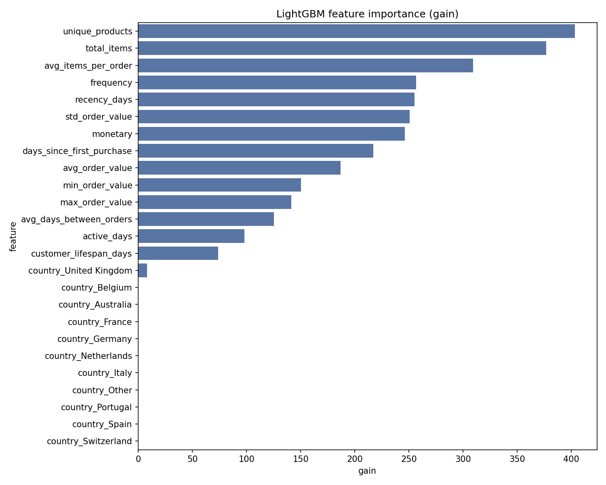

# Customer Purchase Propensity Prediction

**This project builds an end to end propensity modeling pipeline that predicts whether a customer will purchase again within a future time window based on recent transaction behavior and exports ranked scores for targeting and retention use cases**

**This is a practical propensity model because it reaches ROC AUC 0.6408 PR AUC 0.2569 on a sparse 0.1347 base rate while top decile lift 2.6244 and precision 0.4396 at the top 5 percent show strong concentration of future buyers in the highest scores which means marketing can prioritize a small fraction of customers and still recover meaningful recall**

Dataset source: [Kaggle Online Retail II](https://www.kaggle.com/datasets/mathchi/online-retail-ii-data-set-from-ml-repository)

| File | Rows | Columns | Column examples |
|---|---:|---:|---|
| `online_retail_II.csv` | 1048575 | 8 | `Invoice`, `StockCode`, `Description`, `Quantity`, `InvoiceDate`, `Price`, `Customer ID`, `Country` |

## Pipeline steps

1. Input setup Put `online_retail_II.csv` in `data/raw/` and install pinned deps from `requirements.txt`
2. ETL cleaning Standardize columns parse invoice datetime remove invalid quantity price records and save cleaned parquet snapshot
3. Time window snapshots Compute train and test cutoffs from data max date and build observation and prediction windows from config days
4. Label generation Build binary target per customer indicating purchase in the future prediction window after each cutoff
5. Feature engineering Create customer RFM and behavioral aggregates then encode top countries from train only frequency statistics
6. Matrix build Assemble aligned train and test matrices and create time aware internal validation split for early stopping
7. Algorithm Train `lightgbm.LGBMClassifier` and generate propensity scores for hold out customers
8. Evaluation Compute ROC AUC PR AUC threshold precision recall F1 and lift at top segments and export metrics predictions and feature importance outputs

## Outputs and model evidence

| Metric | Value | Evidence file |
|---|---:|---|
| ROC AUC | 0.6408 | `outputs/metrics/val_metrics.json` |
| PR AUC | 0.2569 | `outputs/metrics/val_metrics.json` |
| Positive rate | 0.1347 | `outputs/metrics/val_metrics.json` |
| Holdout customers n | 1811 | `outputs/metrics/val_metrics.json` |
| Precision at top 10 percent | 0.3536 | `outputs/metrics/val_metrics.json` |
| Recall at top 10 percent | 0.2623 | `outputs/metrics/val_metrics.json` |
| Precision at top 5 percent | 0.4396 | `outputs/metrics/val_metrics.json` |
| Recall at top 5 percent | 0.1639 | `outputs/metrics/val_metrics.json` |
| Top decile lift | 2.6244 | `outputs/metrics/val_metrics.json` |

## Project directory

| Path | Description |
|---|---|
| `.gitignore` | Prevents committing local env files raw data and tabular artifacts |
| `README.md` | Documents objective dataset pipeline evidence and file map |
| `config.py` | Central config for time windows cutoffs paths and model params |
| `data/processed/transactions_clean.parquet` | Cleaned transaction dataset produced by ETL step |
| `data/raw/online_retail_II.csv` | Raw online retail transaction source file |
| `outputs/metrics/feature_importance.csv` | Feature importance values exported from trained model |
| `outputs/metrics/val_metrics.json` | Hold out test metrics JSON includes `eval_split` equals holdout_test plus ROC PR lift |
| `outputs/metrics/test_predictions.csv` | Hold out customer level propensity scores |
| `outputs/models/feature_columns.joblib` | Saved feature column order used during training |
| `outputs/models/lgbm_propensity.joblib` | Trained LightGBM propensity classifier |
| `outputs/plots/feature_importance_top.png` | Top feature importance visualization |
| `requirements.txt` | Exact dependency versions required to reproduce the run |
| `run_pipeline.py` | Orchestrates ETL feature label build training evaluation and exports |
| `src/data_loader.py` | Reader for raw Online Retail II file |
| `src/dataset_builder.py` | Merges features with labels and builds aligned modeling matrices |
| `src/evaluate.py` | Metric computation prediction export and plotting helpers |
| `src/feature_engineering.py` | Customer level RFM and behavior feature construction |
| `src/labeling.py` | Future window label generation for each cutoff snapshot |
| `src/preprocess.py` | Transaction cleaning and column normalization utilities |
| `src/train.py` | LightGBM training with time aware validation and model serialization |
| `src/utils.py` | Directory and shared helper utilities |
