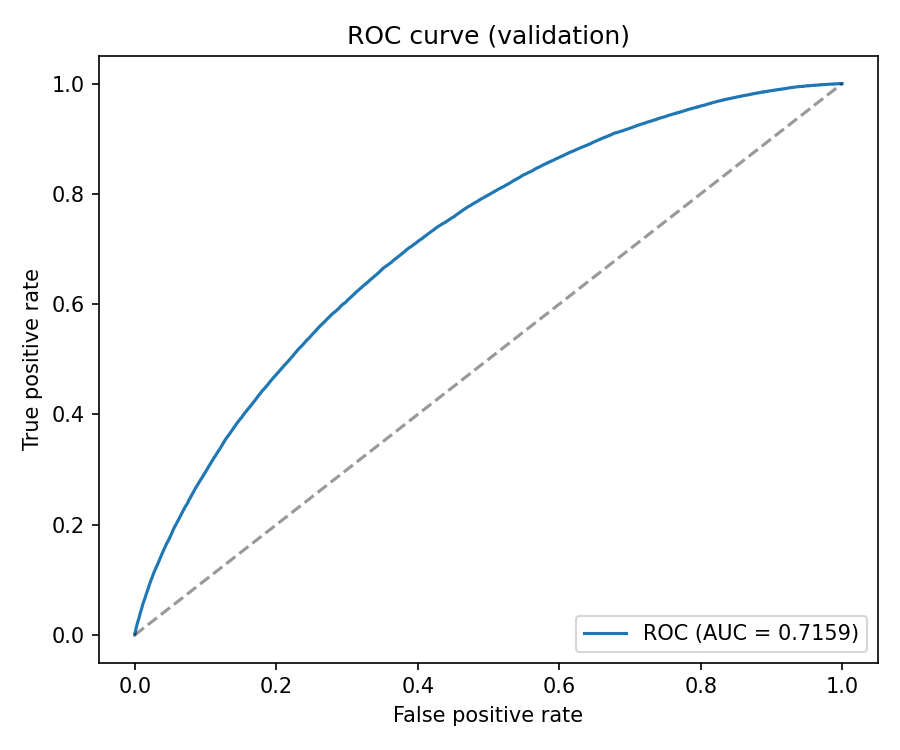
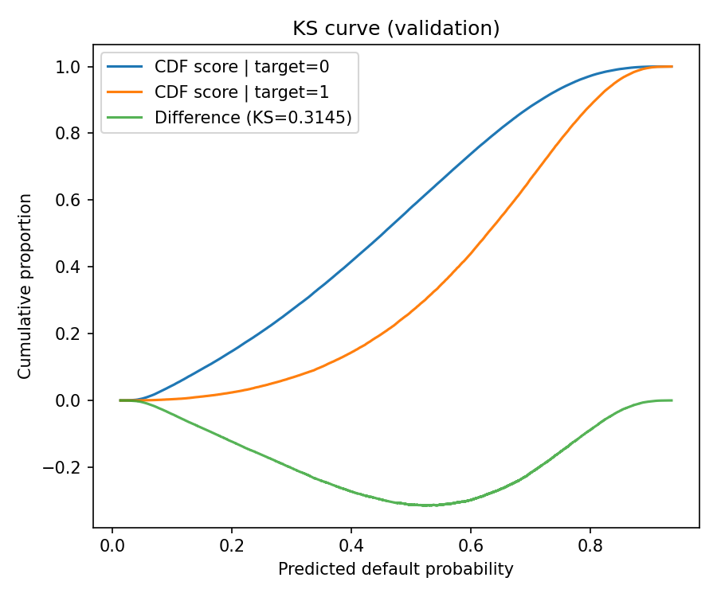
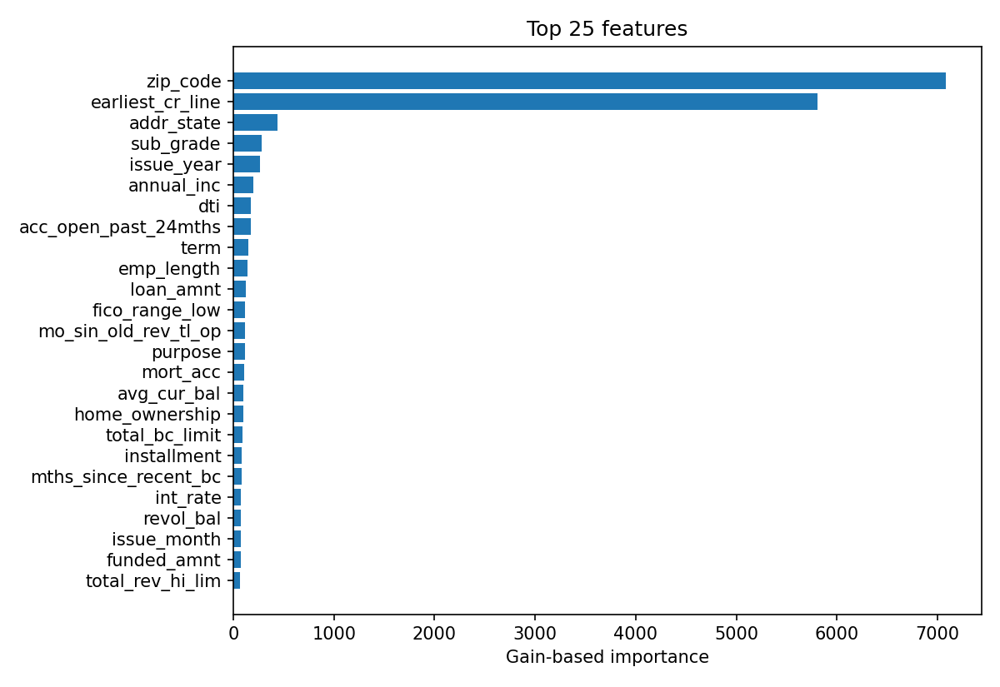

# Loan Portfolio Risk and Expected Loss Modeling

**This project builds an end to end credit risk monitoring pipeline that estimates probability of default loss given default and expected loss for a loan portfolio and exports portfolio level metrics and ranking signals to support collections and risk management decisions**

**This is a strong portfolio risk stack because PD ranking holds up out of sample with ROC AUC 0.7159 and KS 0.3145 while the EL layer concentrates dollars in the riskiest slice with top decile loss capture 0.3547 and LGD error on defaulted loans at RMSE 0.1701 which makes the outputs actionable for monitoring and collection prioritization not just accurate PD alone**

Dataset source: [Kaggle LendingClub Dataset Full 2007 to 2018](https://www.kaggle.com/panchammahto/lendingclub-dataset-full-2007-to-2018)

| File | Rows | Columns | Column examples |
|---|---:|---:|---|
| `accepted_2007_to_2018Q4.csv` | 2260701 | 151 | `loan_amnt`, `term`, `int_rate`, `installment`, `grade`, `sub_grade`, `emp_length`, `annual_inc`, `issue_d`, `loan_status` |
| `rejected_2007_to_2018Q4.csv` | 27648741 | 9 | `Amount Requested`, `Application Date`, `Loan Title`, `Risk_Score`, `Debt-To-Income Ratio`, `Zip Code`, `State` |

## Pipeline steps

1. Input setup Put Lending Club files in `data/raw/` and install pinned deps from `requirements.txt`
2. Data load Read accepted loans and parse key fields like `issue_d` and `term` for modeling
3. Time split Create ordered train validation split by `issue_d` using `VAL_FRACTION` so validation is later in time
4. PD labeling and model Create default target from `loan_status` then train `lightgbm.LGBMClassifier` for probability of default
5. LGD target and model Build LGD from recovery based formulas and train `lightgbm.LGBMRegressor` on defaulted loans only with constant fallback when default sample is small
6. EL computation Calculate `pred_el = pred_pd × pred_lgd × loan_amnt` and produce per loan prediction exports
7. Evaluation Compute PD ROC AUC KS plus LGD RMSE MAE and portfolio EL proxy and top decile loss capture metrics
8. Business simulation Run threshold based collection strategies and export predictions metrics models and plots in `outputs/`

## Outputs and model evidence

| Metric | Value | Evidence file |
|---|---:|---|
| PD ROC AUC validation | 0.7159 | `outputs/metrics/val_metrics.json` |
| PD KS statistic validation | 0.3145 | `outputs/metrics/val_metrics.json` |
| Precision at top 10 percent validation | 0.4807 | `outputs/metrics/val_metrics.json` |
| Recall at top 10 percent validation | 0.2206 | `outputs/metrics/val_metrics.json` |
| LGD RMSE validation defaults | 0.1701 | `outputs/metrics/val_metrics.json` |
| LGD MAE validation defaults | 0.1386 | `outputs/metrics/val_metrics.json` |
| LGD evaluation defaults n | 58637 | `outputs/metrics/val_metrics.json` |
| Portfolio EL proxy total PD times LGD validation | 1420045071.16 | `outputs/metrics/val_metrics.json` |
| Total exposure validation | 3868028675.00 | `outputs/metrics/val_metrics.json` |
| Portfolio EL ratio PD times LGD validation | 0.3671 | `outputs/metrics/val_metrics.json` |
| Top decile loss capture by predicted EL validation | 0.3547 | `outputs/metrics/val_metrics.json` |

## Project directory

| Path | Description |
|---|---|
| `.gitignore` | Prevents committing local env files raw data and tabular artifacts |
| `README.md` | Documents objective dataset pipeline evidence and file map |
| `config.py` | Central config for paths split settings and PD LGD model params |
| `data/raw/accepted_2007_to_2018Q4.csv` | Main Lending Club accepted loans table used for training |
| `data/raw/rejected_2007_to_2018Q4.csv` | Optional rejected applications table retained for context |
| `outputs/metrics/.gitkeep` | Keeps metrics folder in version control |
| `outputs/metrics/business_simulation.json` | Threshold simulation output for collection style decisions |
| `outputs/metrics/predictions.csv` | Validation predictions with PD LGD EL and true loss fields |
| `outputs/metrics/val_metrics.json` | Validation split PD and LGD metrics plus portfolio EL proxy summary |
| `outputs/models/.gitkeep` | Keeps models folder in version control |
| `outputs/models/lgd_model.joblib` | Trained LGD regression model on defaulted loans |
| `outputs/models/model.joblib` | Legacy or compatibility model artifact from previous run |
| `outputs/models/pd_model.joblib` | Trained PD classification model |
| `outputs/plots/.gitkeep` | Keeps plots folder in version control |
| `outputs/plots/feature_importance_top.png` | Top feature importance chart for PD model |
| `outputs/plots/ks_curve.png` | KS curve for PD score separation |
| `outputs/plots/roc_curve.png` | ROC curve for PD ranking quality |
| `outputs/plots/shap_summary_bar.png` | Optional SHAP explanation summary plot |
| `requirements.txt` | Exact dependency versions required to reproduce the run |
| `run_pipeline.py` | Orchestrates target build PD LGD training EL scoring and exports |
| `src/business.py` | EL calculations top decile capture and threshold simulation logic |
| `src/data_loader.py` | Reader and base filtering for Lending Club accepted data |
| `src/evaluation.py` | PD LGD metric functions plotting and metric serialization |
| `src/feature_engineering.py` | Feature matrix preparation ordered split and column sanitization |
| `src/leakage_filters.py` | Leakage column checks for post outcome fields |
| `src/modeling.py` | LightGBM training and prediction for PD and LGD |
| `src/preprocessing.py` | LGD target construction and preprocessing helpers |
| `src/utils.py` | Shared helper functions used across modules |
