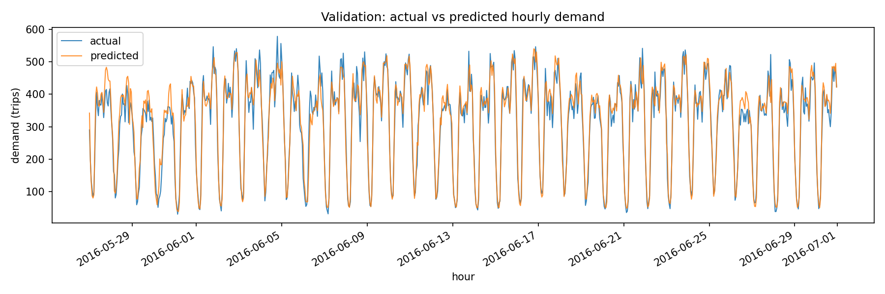

# NYC Taxi Hourly Demand Forecasting

**This project builds an end to end time series forecasting pipeline that converts NYC taxi trip records into an hourly demand signal and predicts future ride volume to support operational planning and supply allocation**

**This is a credible demand forecast because on the chronological validation hours LightGBM beats naive persistence RMSE 65.9913 and seasonal lag168 RMSE 56.5104 while reaching RMSE 33.2888 MAE 25.0486 and MAPE 0.0954 which means the model adds clear value over simple baselines for staffing oriented hour ahead views without peeking at future data**

Dataset source: [Kaggle New York City Taxi Trip Duration](https://www.kaggle.com/competitions/nyc-taxi-trip-duration/data)

| File | Rows | Columns | Column examples |
|---|---:|---:|---|
| `train.csv` | 1458644 | 11 | `id`, `vendor_id`, `pickup_datetime`, `dropoff_datetime`, `passenger_count`, `pickup_longitude`, `pickup_latitude`, `trip_duration` |

## Pipeline steps

1. Input setup Put `train.csv` in `data/raw/` and install pinned deps from `requirements.txt`
2. ETL cleaning Parse `pickup_datetime` drop invalid rows and standardize trip records used for aggregation
3. ETL target build Aggregate trip rows to hourly demand counts using `hourly_demand` and save `data/processed/hourly_demand.csv`
4. Feature engineering Create calendar features plus lag and rolling demand features in `src/feature_engineering.py` then drop rows lacking lag history
5. Split strategy Keep chronological order and split by `TRAIN_RATIO` with no shuffle to simulate forecasting on future hours
6. Algorithm Train `lightgbm.LGBMRegressor` with validation based early stopping using engineered demand features
7. Evaluation On the same validation hours compare LightGBM to naive baselines persistence `demand_lag_1` and seasonal `demand_lag_168` write all metrics to `outputs/metrics/val_metrics.json` and save `outputs/plots/demand_forecast.png`

## Outputs and model evidence

| Metric | Value | Evidence file |
|---|---:|---|
| LightGBM RMSE validation | 33.2888 | `outputs/metrics/val_metrics.json` |
| LightGBM MAE validation | 25.0486 | `outputs/metrics/val_metrics.json` |
| LightGBM MAPE validation | 0.0954 | `outputs/metrics/val_metrics.json` |
| Naive persistence lag1 RMSE | 65.9913 | `outputs/metrics/val_metrics.json` |
| Naive seasonal lag168 RMSE | 56.5104 | `outputs/metrics/val_metrics.json` |

## Project directory

| Path | Description |
|---|---|
| `.gitignore` | Prevents committing local env files raw data and tabular artifacts |
| `README.md` | Documents objective dataset pipeline evidence and file map |
| `config.py` | Central config for paths feature list split ratio and model params |
| `data/processed/hourly_demand.csv` | ETL output with full hourly demand grid after aggregation |
| `data/raw/sample_submission.csv` | Original Kaggle template file retained for reference |
| `data/raw/test.csv` | Original Kaggle test file not used in this forecasting track |
| `data/raw/train.csv` | Raw trip level training data used to build hourly demand |
| `outputs/metrics/val_metrics.json` | Validation metrics for LightGBM plus naive baseline RMSE MAE MAPE |
| `outputs/models/demand_model.joblib` | Trained LightGBM demand forecasting model |
| `outputs/plots/demand_forecast.png` | Actual vs predicted demand curve on validation horizon |
| `requirements.txt` | Exact dependency versions required to reproduce the run |
| `run_pipeline.py` | Orchestrates ETL feature generation model training evaluation and exports |
| `src/__init__.py` | Package marker for importing source modules |
| `src/aggregation.py` | Converts trip rows into hourly demand counts |
| `src/data_loader.py` | Reader for raw taxi CSV files |
| `src/evaluate.py` | Regression metrics and plotting utilities |
| `src/feature_engineering.py` | Builds calendar lag rolling and hour index features |
| `src/forecasting.py` | Inference helpers for demand prediction |
| `src/model.py` | LightGBM regressor training and split utilities |
| `src/preprocess.py` | Trip cleaning and datetime preparation logic |
