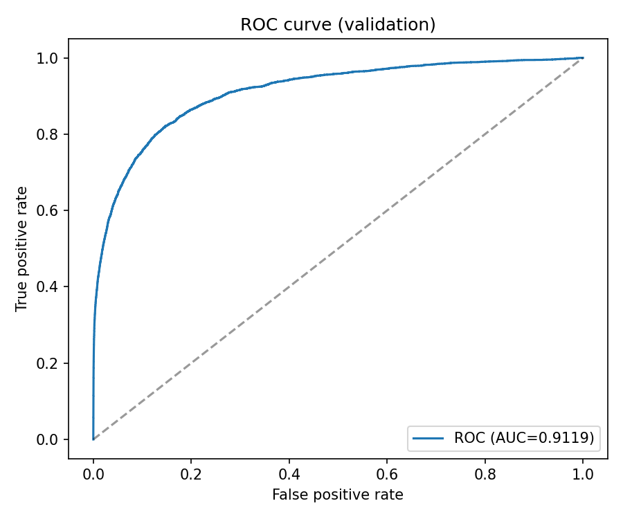
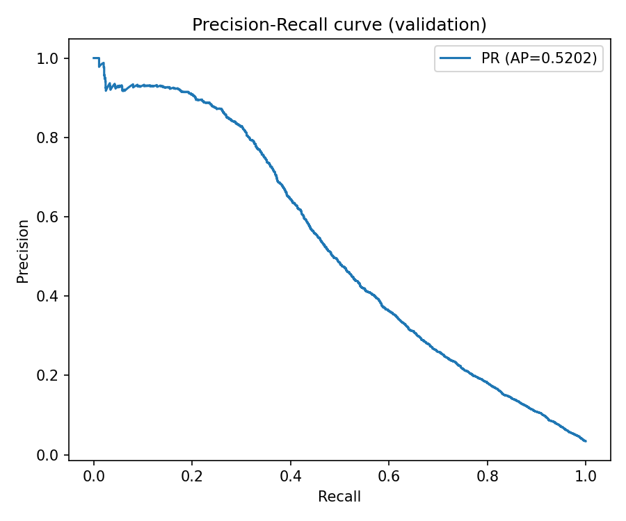
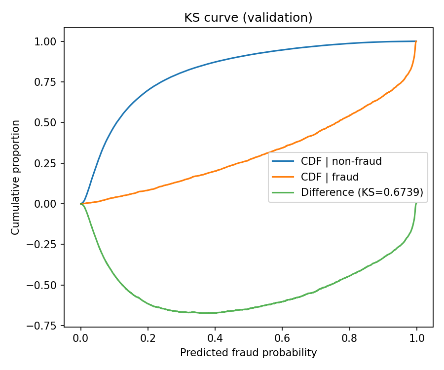
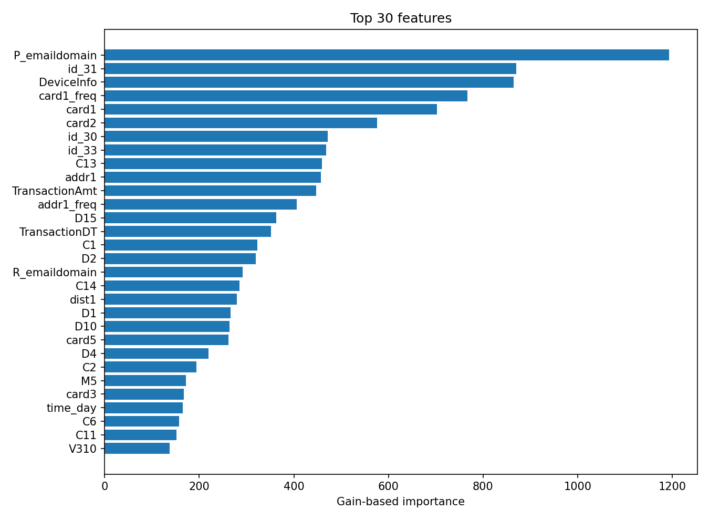

# Transaction Fraud Detection and Risk Scoring

**This project builds an end to end fraud scoring pipeline that predicts the probability of a transaction being fraudulent and produces business oriented outputs for operational decisioning such as risk ranking and review prioritization**

**This is a strong fraud model because it combines high ranking discrimination on the held out time slice with ROC AUC 0.9119 and KS 0.6739 plus review budget and three way threshold results that keep fraud capture near 0.995 under an aggressive block rule which means the score is not only statistically strong but also aligned with operational allow review block workflows**

Dataset source: [Kaggle IEEE CIS Fraud Detection](https://www.kaggle.com/competitions/ieee-fraud-detection/data)

| File | Rows | Columns | Column examples |
|---|---:|---:|---|
| `train_transaction.csv` | 590540 | 394 | `TransactionID`, `isFraud`, `TransactionDT`, `TransactionAmt`, `ProductCD`, `card1` to `card6`, `addr1`, `addr2`, `V1` |
| `train_identity.csv` | 144233 | 41 | `TransactionID`, `id_01` to `id_11`, `DeviceType`, `DeviceInfo` |
| `test_transaction.csv` | 506691 | 393 | `TransactionID`, `TransactionDT`, `TransactionAmt`, `ProductCD`, `card1` to `card6`, `addr1`, `addr2`, `V1` |
| `test_identity.csv` | 141907 | 41 | `TransactionID`, `id-01` to `id-11`, `DeviceType`, `DeviceInfo` |
| `sample_submission.csv` | 506691 | 2 | `TransactionID`, `isFraud` |

## Pipeline steps

1. Input setup Put `train_transaction.csv` `train_identity.csv` `test_transaction.csv` `test_identity.csv` in `data/raw/` and install pinned deps from `requirements.txt`
2. ETL schema normalization Load train and test tables and normalize identity columns from `id-xx` to `id_xx` so train and test share the same schema
3. ETL merge and checks Join transaction and identity on `TransactionID` then run sanity checks for label presence identity key uniqueness and train test schema alignment
4. ETL feature frame Build model frame with missingness indicators and amount time transforms from `TransactionAmt` and `TransactionDT`
5. Leakage handling Remove forbidden post outcome columns via `src/leakage_filters.py` before any model fitting
6. Feature encoding Fit object category handling on train only then apply to validation and test and align feature columns across splits
7. Validation strategy Perform chronological split by `TransactionDT` using `VAL_FRACTION` and enforce `train max time < val min time`
8. Algorithm Train `lightgbm.LGBMClassifier` with config params and early stopping on validation AUC
9. Metrics Compute ROC AUC PR AUC KS and ranking metrics on the temporal validation split save them to `outputs/metrics/val_metrics.json` then save scored validation and test outputs
10. Business layer Run threshold grid simulation and review budget analysis and export JSON CSV model and diagnostic plots to `outputs/`

## Outputs and model evidence

| Metric | Value | Evidence file |
|---|---:|---|
| ROC AUC validation | 0.9119 | `outputs/metrics/val_metrics.json` |
| PR AUC validation | 0.5202 | `outputs/metrics/val_metrics.json` |
| KS statistic validation | 0.6739 | `outputs/metrics/val_metrics.json` |
| Top 1 percent review precision | 0.8721 | `outputs/metrics/review_budget_analysis.json` |
| Top 1 percent loss proxy capture rate | 0.0249 | `outputs/metrics/review_budget_analysis.json` |
| Top 10 percent loss proxy capture rate | 0.4091 | `outputs/metrics/review_budget_analysis.json` |
| Flagged fraud capture rate allow 0.02 block 0.90 | 0.9953 | `outputs/metrics/business_simulation.json` |
| Fraud rate in blocked slice allow 0.02 block 0.90 | 0.7662 | `outputs/metrics/business_simulation.json` |

## Project directory

| Path | Description |
|---|---|
| `.gitignore` | Prevents committing local env files raw data and tabular artifacts |
| `README.md` | Explains goal dataset pipeline evidence and file structure |
| `config.py` | Central config for paths thresholds row caps and LightGBM hyperparameters |
| `data/raw/sample_submission.csv` | Kaggle sample submission template used as reference output format |
| `data/raw/test_identity.csv` | Raw identity attributes for test transactions before schema normalization |
| `data/raw/test_transaction.csv` | Raw test transaction table used for inference scoring |
| `data/raw/train_identity.csv` | Raw identity attributes for train transactions joined by `TransactionID` |
| `data/raw/train_transaction.csv` | Raw training transaction table with fraud labels |
| `outputs/metrics/business_simulation.json` | Threshold scenario results for allow review block style decisions |
| `outputs/metrics/data_summary.json` | Run level data snapshot such as split sizes label rates and time ranges |
| `outputs/metrics/feature_columns.json` | Exact model feature list used for reproducibility |
| `outputs/metrics/review_budget_analysis.json` | Fraud capture under fixed review budgets like top 1 3 5 10 percent |
| `outputs/metrics/run_config.json` | Serialized run settings and model params for auditability |
| `outputs/metrics/val_metrics.json` | Validation split metrics including ROC AUC PR AUC KS and top K precision |
| `outputs/metrics/test_predictions.csv` | Scored test transactions with fraud probabilities |
| `outputs/metrics/val_predictions.csv` | Validation scores used for threshold and lift analysis |
| `outputs/models/fraud_model.joblib` | Persisted trained LightGBM fraud classifier |
| `outputs/plots/feature_importance.png` | Global feature importance chart from model gain importance |
| `outputs/plots/ks_curve.png` | KS curve showing separation between fraud and non fraud score distributions |
| `outputs/plots/pr_curve.png` | Precision recall curve emphasizing minority class performance |
| `outputs/plots/roc_curve.png` | ROC curve for ranking discrimination across thresholds |
| `outputs/plots/shap_summary_bar.png` | Optional SHAP summary plot for model interpretability |
| `requirements.txt` | Exact dependency versions required to reproduce the run |
| `run_pipeline.py` | Orchestrates ETL feature engineering training evaluation simulation and exports |
| `src/business.py` | Fraud loss proxy and threshold simulation logic |
| `src/data_loader.py` | Typed readers for train and test transaction identity files |
| `src/evaluation.py` | Metric computation plotting and JSON CSV export helpers |
| `src/feature_engineering.py` | Feature frame preparation encoding and time split helpers |
| `src/leakage_filters.py` | Central list of forbidden leakage features removed before training |
| `src/modeling.py` | LightGBM training wrapper and probability prediction functions |
| `src/preprocessing.py` | Schema checks identity normalization merges and basic transformations |
| `src/utils.py` | Utility helpers shared across pipeline modules |
